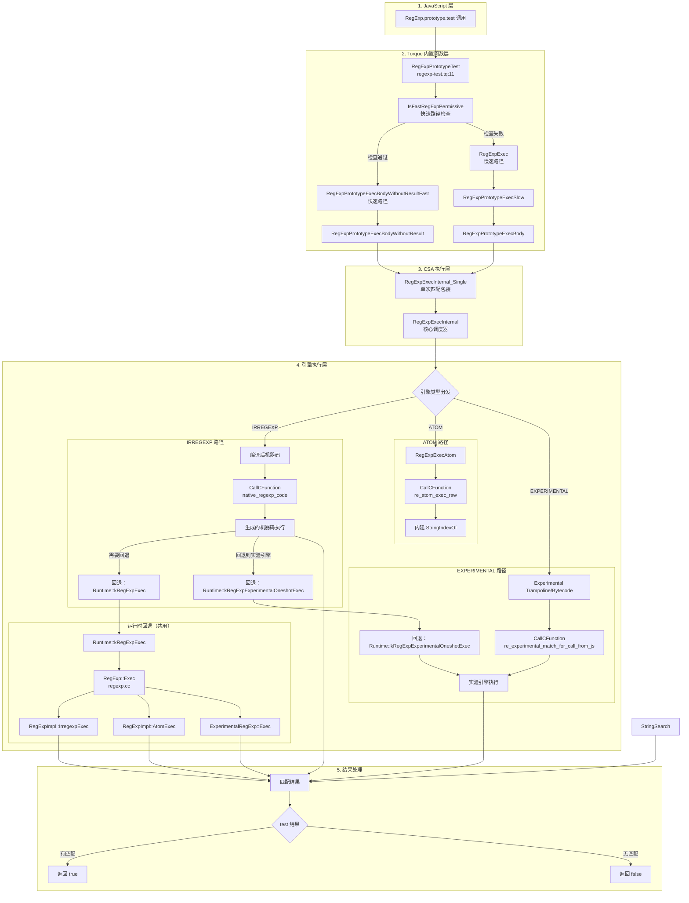

```mermaid
flowchart TD
    subgraph "1. JavaScript 层"
        JS[RegExp.prototype.test 调用]
    end
    
    subgraph "2. Torque 内置函数层"
        Entry[RegExpPrototypeTest<br/>regexp-test.tq:11]
        FastCheck[IsFastRegExpPermissive<br/>快速路径检查]
        
        FastPath[RegExpPrototypeExecBodyWithoutResultFast<br/>快速路径]
        SlowPath[RegExpExec<br/>慢速路径]
        
        FastExec[RegExpPrototypeExecBodyWithoutResult]
        SlowExec[RegExpPrototypeExecSlow]
        SlowBody[RegExpPrototypeExecBody]
    end
    
    subgraph "3. CSA 执行层"
        Single[RegExpExecInternal_Single<br/>单次匹配包装]
        Internal[RegExpExecInternal<br/>核心调度器]
    end
    
    subgraph "4. 引擎执行层"
        Dispatch{引擎类型分发}
        
        subgraph "IRREGEXP 路径"
            IrregexpCode[编译后机器码]
            NativeCall[CallCFunction<br/>native_regexp_code]
            MachineCode[生成的机器码执行]
      IRToRuntime[回退：Runtime::kRegExpExec]
      IRToExpRuntime[回退：Runtime::kRegExpExperimentalOneshotExec]
        end
        
    subgraph "ATOM 路径"
      AtomExec[RegExpExecAtom]
      AtomCall[CallCFunction<br/>re_atom_exec_raw]
      StringIndexOf[内建 StringIndexOf]
    end
        
    subgraph "运行时回退（共用）"
            RuntimeExec[Runtime::kRegExpExec]
            RegexpCC[RegExp::Exec<br/>regexp.cc]
            IrregexpImpl[RegExpImpl::IrregexpExec]
            AtomImpl[RegExpImpl::AtomExec]
            ExpImpl[ExperimentalRegExp::Exec]
        end

    subgraph "EXPERIMENTAL 路径"
      ExpCode[Experimental Trampoline/Bytecode]
      ExpNativeCall[CallCFunction<br/>re_experimental_match_for_call_from_js]
      ExpMachine[实验引擎执行]
      ExpRuntime[回退：Runtime::kRegExpExperimentalOneshotExec]
    end
    end
    
    subgraph "5. 结果处理"
        Result[匹配结果]
        BoolResult{test 结果}
        ReturnTrue[返回 true]
        ReturnFalse[返回 false]
    end
    
    %% 连接关系
    JS --> Entry
    Entry --> FastCheck
    
    FastCheck -->|检查通过| FastPath
    FastCheck -->|检查失败| SlowPath
    
    FastPath --> FastExec
    SlowPath --> SlowExec
    SlowExec --> SlowBody
    
    FastExec --> Single
    SlowBody --> Single
    Single --> Internal
    
    Internal --> Dispatch
    
  Dispatch -->|IRREGEXP| IrregexpCode
  Dispatch -->|ATOM| AtomExec
  Dispatch -->|EXPERIMENTAL| ExpCode
    
    IrregexpCode --> NativeCall --> MachineCode
  MachineCode -->|需要回退| IRToRuntime --> RuntimeExec
  MachineCode -->|回退到实验引擎| IRToExpRuntime --> ExpRuntime

  AtomExec --> AtomCall --> StringIndexOf

  RuntimeExec --> RegexpCC
    RegexpCC --> IrregexpImpl
    RegexpCC --> AtomImpl
    RegexpCC --> ExpImpl
  ExpCode --> ExpNativeCall --> ExpMachine
  ExpRuntime --> ExpMachine
    
    MachineCode --> Result
    StringSearch --> Result
    IrregexpImpl --> Result
    AtomImpl --> Result
  ExpImpl --> Result
  ExpMachine --> Result
    
    Result --> BoolResult
    BoolResult -->|有匹配| ReturnTrue
    BoolResult -->|无匹配| ReturnFalse
```