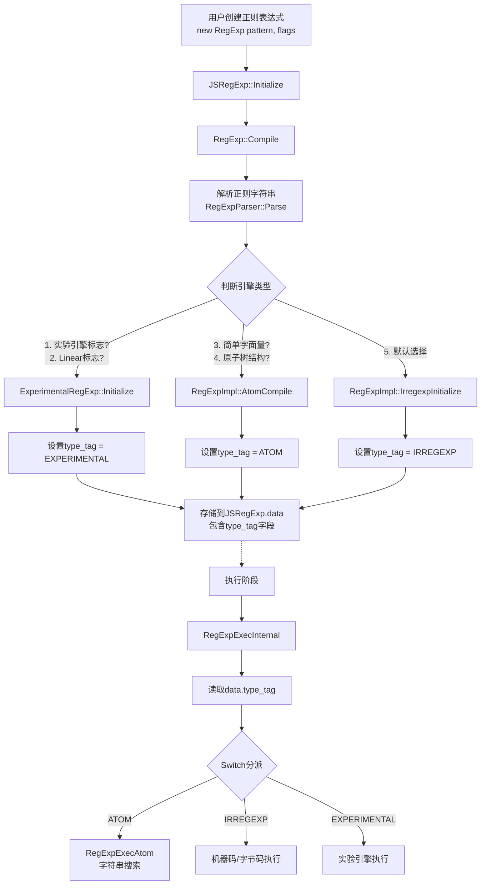

# 背景
最近在写[油猴脚本](https://github.com/chesha1/color-visited)，遇到需要大量进行正则表达式匹配的场景，因为油猴脚本在用户端运行，所以希望能抠一点性能出来，哪怕能节约 1 ms 也是好的

这里就有一个优化场景：`new RegExp(/a/).test('abc')` 和 `new RegExp(/abc/).test('abc')` 都会返回 `true`，那么是否需要用开发者的先验，尽量在正则表达式中提供更多的信息，节约匹配时的计算量？

然后就联想到 [leetcode 中做过的“正则表达式匹配”题](https://leetcode.cn/problems/regular-expression-matching/)，不过那只是 `.` 和 `*` 的简化场景，这次正好借机看看生产环境里实际的正则匹配是怎么做的


# 原理
从编译原理视角，正则表达式（Regular Expression, RE）描述的是"正则语言"，对应可被有限自动机识别：

- 正则 → ε-NFA（Thompson 构造法：递归地为每个正则子表达式构造 NFA 片段，用 ε-转换连接）
- ε-NFA → DFA（子集构造，可选最小化）
- 用自动机在输入上“运行”即可完成匹配（锚定匹配与搜索仅是起始位置选择与边界条件不同）

教科书上的“RE→NFA→DFA→匹配”给了一个线性时间、确定性的理想范式，但在工程实践中很少直接构造整张 DFA，原因是：
- 状态爆炸：某些模式的 DFA 状态数指数级，内存不可控
- 特性缺失：DFA 框架天然不支持“回溯语义”“反向引用”等非正规特性

因此主流引擎会在三条路径中权衡：
- 回溯 VM：沿语法树深度优先搜索，功能强（支持环视、反向引用），但最坏情形指数时间（灾难性回溯）
- NFA 仿真（非回溯）：像 RE2 一样用工作队列同时推进多个 NFA 状态，时间线性但不支持反向引用等
- DFA/字面量特化：对纯字面量或可归约为固定字符串集的情形走字符串搜索（如 Boyer–Moore / `String.indexOf` 快路径）

结合 V8 的实现，可以更精确地理解“V8 干了什么”：

- V8 的主力引擎叫 Irregexp。它将正则表达式解析成 AST，然后编译为字节码（解释执行）或机器码（JIT 编译）。执行时采用回溯算法，但通过大量优化减少回溯开销：包括快速失败检查、前缀优化、字符类预检查等
- 对于完全"无元字符"的纯字面量，V8 在正则对象初始化时将类型标记为 ATOM，直接退化成字符串搜索（内部走 `Builtin::kStringIndexOf` 的快路径）
- 为避免灾难性回溯，V8 实现了一个实验性的线性时间引擎。当正则表达式不包含反向引用、环视断言等复杂特性时，会尝试使用该引擎进行匹配。该引擎基于 NFA 仿真，能保证线性时间复杂度。如果实验引擎无法处理，会回退到传统的 Irregexp 引擎


V8 中具体实现的代码看起来很难受，是因为并非直接写“匹配循环”，而是在操作编译器：
- 解析与分析正则
- 为不同输入与标志位生成不同形态的字节码/机器码
- 在运行时按类型（IRREGEXP/ATOM/EXPERIMENTAL）调度到最合适的执行引擎


# 实现细节
## 执行流程概览
此处配一张 mermaid 图。因图较大，这里预览不便，请见仓库中的 [mermaid/regex-1.md](https://github.com/chesha1/blog/blob/main/mermaid/regex-1.md)


## 详细调用链

### 1. 入口点：RegExpPrototypeTest

**文件位置**: `src/builtins/regexp-test.tq:11-27`

```cpp
transitioning javascript builtin RegExpPrototypeTest(
    js-implicit context: NativeContext, receiver: JSAny)(
    string: JSAny): JSAny {
  const methodName: constexpr string = 'RegExp.prototype.test';
  const receiver = Cast<JSReceiver>(receiver)
      otherwise ThrowTypeError(
      MessageTemplate::kIncompatibleMethodReceiver, methodName, receiver);
  const str: String = ToString_Inline(string);
  if (IsFastRegExpPermissive(receiver)) {
    RegExpPrototypeExecBodyWithoutResultFast(
        UnsafeCast<JSRegExp>(receiver), str)
        otherwise return False;
    return True;
  }
  const matchIndices = RegExpExec(receiver, str);
  return SelectBooleanConstant(matchIndices != Null);
}
```

**执行步骤**:
1. 类型检查：确保 `receiver` 是 `JSReceiver`
2. 字符串转换：将输入参数转换为字符串
3. 快速路径检查：调用 `IsFastRegExpPermissive()` 
4. 根据检查结果选择执行路径

### 2. 快速路径检查：IsFastRegExpPermissive

**文件位置**: `src/builtins/regexp.tq`（宏声明），具体快速检查逻辑在 `src/builtins/builtins-regexp-gen.cc`

在 Torque 中导出 `IsFastRegExpPermissive/IsFastRegExpForMatch/IsFastRegExpForSearch/IsFastRegExpStrict` 这些宏，它们内部通过 CSA 的 `BranchIfFastRegExp_*` 实现在 C++ 中完成实际检查。

**核心实现**: `src/builtins/builtins-regexp-gen.cc` 中的 `RegExpBuiltinsAssembler::BranchIfFastRegExp` 及其包装 `BranchIfFastRegExp_Permissive/Strict/ForMatch/ForSearch`

#### 什么是"优化的执行路径"？

快速路径检查确定是否可以跳过昂贵的动态查找，直接使用内置的优化实现。具体检查以下条件：

实际检查步骤：
- 强制慢速路径开关：`GotoIfForceSlowPath(if_ismodified);`
- Species protector：`GotoIf(IsRegExpSpeciesProtectorCellInvalid(), if_ismodified);`
- 初始 map 相等：从 `NativeContext::REGEXP_FUNCTION_INDEX` 取初始 map，`TaggedEqual(map, initial_map)`；不相等则慢速。
- lastIndex 为正 Smi：`FastLoadLastIndexBeforeSmiCheck` 读取对象内字段，要求 `TaggedIsPositiveSmi`，否则慢速。
- 原型检查：使用 `PrototypeCheckAssembler` 根据不同 flags 检查 `RegExp.prototype` 上关键属性（如 exec/search/match）是否保持 const 或恒等。

#### 两种检查模式

两种模式及差异：
- Strict（严格）：`kCheckPrototypePropertyConstness`，只检查描述符“常量性”（不做值等同性检查）。
- Permissive（宽松）：`kCheckFull = Constness | Identity`，在常量性失败时，允许继续做“值恒等”检查，若值仍与初始内建函数相同，则仍可走快路径。
另外，`ForMatch/ForSearch` 还会附加检查相应的 `@@match/@@search` 描述符索引与初始值匹配。

#### 为什么需要这些检查？

**性能优化的前提**：
- 避免属性查找：直接调用内置函数，无需在原型链上查找
- 跳过类型转换：已知数据类型，避免动态转换
- 内联优化：编译器可以内联调用，减少函数调用开销
- 避免用户代码执行：防止 getter/setter 被调用

**如果检查失败会怎样**：
- 回退到慢速路径（`RegExpExec`）
- 进行完整的属性查找
- 调用可能被重写的方法
- 执行完整的类型检查和转换

### 3A. 快速路径：RegExpPrototypeExecBodyWithoutResultFast

**文件位置**: `src/builtins/regexp.tq:123-129`

```cpp
transitioning macro RegExpPrototypeExecBodyWithoutResultFast(
    implicit context: Context)(regexp: JSRegExp,
    string: String): RegExpMatchInfo labels IfDidNotMatch {
  const lastIndex = LoadLastIndexAsLength(regexp, true);
  return RegExpPrototypeExecBodyWithoutResult(regexp, string, lastIndex, true)
      otherwise IfDidNotMatch;
}
```

**核心函数**: `RegExpPrototypeExecBodyWithoutResult`

**文件位置**: `src/builtins/regexp.tq:86-120`

主要逻辑：
1. 检查 global 或 sticky 标志
2. 如果是 global/sticky，更新 lastIndex
3. 调用 `RegExpExecInternal_Single` 执行匹配

### 3B. 慢速路径：RegExpExec

**文件位置**: `src/builtins/regexp.tq:42-67`

```cpp
transitioning macro RegExpExec(
    implicit context: Context)(receiver: JSReceiver, string: String): JSAny {
  const exec = GetProperty(receiver, 'exec');
  
  typeswitch (exec) {
    case (execCallable: Callable): {
      const result = Call(context, execCallable, receiver, string);
      if (result != Null) {
        ThrowIfNotJSReceiver(
            result, MessageTemplate::kInvalidRegExpExecResult, '');
      }
      return result;
    }
    case (Object): {
      const regexp = Cast<JSRegExp>(receiver) otherwise ThrowTypeError(
          MessageTemplate::kIncompatibleMethodReceiver, 'RegExp.prototype.exec',
          receiver);
      return RegExpPrototypeExecSlow(regexp, string);
    }
  }
}
```

执行步骤：
1. 获取 `exec` 属性
2. 如果 `exec` 是可调用的，直接调用
3. 否则回退到内置的慢速实现

### 4. 核心执行：RegExpExecInternal_Single

**文件位置**: `src/builtins/builtins-regexp-gen.cc`（见 RegExpBuiltinsAssembler::RegExpExecInternal_Single）

关键步骤：
- 读取 `RegExpData`，计算每次匹配所需寄存器数量：`RegistersForCaptureCount(LoadCaptureCount(data))`，并据此分配或借用 `result_offsets_vector`（可能复用静态缓冲或动态分配）。
- 用异常保护块包裹对 `RegExpExecInternal` 的调用；若抛异常，先释放向量再 `Runtime::kReThrow`。
- 若返回 0 次匹配：释放向量，跳转 `if_not_matched`；否则仅允许返回 1（single 模式），并用 `InitializeMatchInfoFromRegisters` 将 offset 写入 `last_match_info`，然后释放向量并返回。
注意：无论成功、失败或异常，`result_offsets_vector` 都会被释放或归还（DEBUG 下还会清零隐式参数）。

### 5. 底层执行引擎：RegExpExecInternal

**文件位置**: `src/builtins/builtins-regexp-gen.cc`

`RegExpExecInternal` 是正则表达式执行的核心调度器，负责：
1. 字符串预处理
2. 执行引擎选择和分发  
3. 结果处理和错误恢复

## `RegExpExecInternal` 底层执行细节

### 输入验证和字符串预处理

在正则表达式执行之前，V8 需要对输入进行严格的验证和预处理：

**参数验证阶段**
```cpp
// 验证 lastIndex 的有效性和边界检查
CSA_DCHECK(this, IsNumberNormalized(last_index));
CSA_DCHECK(this, IsNumberPositive(last_index));
GotoIf(TaggedIsNotSmi(last_index), &out, GotoHint::kFallthrough);

// 边界检查：lastIndex > string.length 时直接失败
TNode<IntPtrT> int_string_length = LoadStringLengthAsWord(string);
TNode<IntPtrT> int_last_index = PositiveSmiUntag(CAST(last_index));
GotoIf(UintPtrGreaterThan(int_last_index, int_string_length), &out);
```

**字符串扁平化处理**
```cpp
// 字符串扁平化：展开 SlicedString 等复合字符串
ToDirectStringAssembler to_direct(state(), string);
to_direct.ToDirect();
```

这一步骤将复合字符串（如 `SlicedString`、`ConsString`）转换为连续的内存表示，确保后续的模式匹配能够高效访问字符数据。

### 引擎类型初始化判断

在正则表达式对象创建时（`JSRegExp::Initialize` → `RegExp::Compile`），V8 根据解析结果决定使用哪个引擎：

**引擎选择的完整判断流程** (`src/regexp/regexp.cc:239-285`):

```cpp
bool has_been_compiled = false;

// 1. 优先检查实验引擎标志
if (v8_flags.default_to_experimental_regexp_engine &&
    ExperimentalRegExp::CanBeHandled(parse_result.tree, pattern, flags,
                                     parse_result.capture_count)) {
  ExperimentalRegExp::Initialize(isolate, re, pattern, flags,
                                 parse_result.capture_count);
  has_been_compiled = true;
}
// 2. 检查linear标志（强制实验引擎）
else if (flags & JSRegExp::kLinear) {
  if (!ExperimentalRegExp::CanBeHandled(parse_result.tree, pattern, flags,
                                        parse_result.capture_count)) {
    // 抛出NotLinear错误
  }
  ExperimentalRegExp::Initialize(isolate, re, pattern, flags,
                                 parse_result.capture_count);
  has_been_compiled = true;
}
// 3. 判断 ATOM 引擎条件一：简单字面量模式
else if (parse_result.simple && !IsIgnoreCase(flags) && !IsSticky(flags) &&
         !HasFewDifferentCharacters(pattern)) {
  // Parse-tree是单个原子且等于模式本身
  RegExpImpl::AtomCompile(isolate, re, pattern, flags, pattern);
  has_been_compiled = true;
}
// 4. 判断 ATOM 引擎条件二：原子树结构  
else if (parse_result.tree->IsAtom() && !IsSticky(flags) &&
         parse_result.capture_count == 0) {
  RegExpAtom* atom = parse_result.tree->AsAtom();
  base::Vector<const base::uc16> atom_pattern = atom->data();
  DirectHandle<String> atom_string;
  // 转义序列在 atom_string 中已解析
  ASSIGN_RETURN_ON_EXCEPTION(
      isolate, atom_string,
      isolate->factory()->NewStringFromTwoByte(atom_pattern));
  if (!IsIgnoreCase(flags) && !HasFewDifferentCharacters(atom_string)) {
    RegExpImpl::AtomCompile(isolate, re, pattern, flags, atom_string);
    has_been_compiled = true;
  }
}
// 5. 默认使用 IRREGEXP 引擎
if (!has_been_compiled) {
  RegExpImpl::IrregexpInitialize(isolate, re, pattern, flags,
                                 parse_result.capture_count, backtrack_limit,
                                 bit_field);
}
```

**三种引擎的选择条件总结**:

| 引擎类型 | 判断条件 |
|---------|---------|
| **EXPERIMENTAL** | `enable_experimental_regexp_engine=true` 且 (`default_to_experimental_regexp_engine=true` 或 `flags & JSRegExp::kLinear`) 且 `ExperimentalRegExp::CanBeHandled()` |
| **ATOM** | **条件一**: `parse_result.simple` + 无ignoreCase + 无sticky + 字符种类丰富<br/>**条件二**: `parse_result.tree->IsAtom()` + 无捕获组 + 无sticky + 无ignoreCase + 字符种类丰富 |
| **IRREGEXP** | 不满足上述条件的所有情况（默认选择） |

**ATOM 引擎的特殊限制**:
- `HasFewDifferentCharacters()`: 避免与 Boyer-Moore 优化冲突，字符种类太少时不使用 ATOM
- 无捕获组：ATOM 引擎不支持复杂的匹配信息记录  
- 无 ignoreCase/sticky：这些功能需要 IRREGEXP 引擎处理

**引擎选择的完整时间线**:



**关键要点**:
1. **初始化时决定**: 引擎类型在正则对象创建时就确定，而非执行时判断
2. **标签存储**: 类型信息存储在`RegExpData::kTypeTagOffset`字段中
3. **执行分派**: `RegExpExecInternal`只是读取已存储的类型标签进行分派

### 执行引擎分发机制

V8 根据初始化时确定的正则表达式数据类型选择执行引擎，并在需要时回退到运行时：

**引擎类型判断**
```cpp
TNode<Int32T> tag =
  SmiToInt32(LoadObjectField<Smi>(data, RegExpData::kTypeTagOffset));

int32_t values[] = {
  static_cast<uint8_t>(RegExpData::Type::IRREGEXP),
  static_cast<uint8_t>(RegExpData::Type::ATOM),
  static_cast<uint8_t>(RegExpData::Type::EXPERIMENTAL),
};
Label* labels[] = {&next, &atom, &next};
Switch(tag, &unreachable, values, labels, arraysize(values));
```
说明：当类型为 IRREGEXP 或 EXPERIMENTAL 时，都会先走 `&next` 分支；随后通用路径会装载代码入口。如果是 IR 字节码解释器返回“回退到实验引擎”，则跳到 `retry_experimental`，一次性调用 `Runtime::kRegExpExperimentalOneshotExec`。另外，当正则在初始化阶段就被标记为 EXPERIMENTAL 时，其 `IrRegExpData::code` 字段会指向实验引擎的 trampoline（见 `Builtins::Generate_RegExpExperimentalTrampoline`），但分发处仍复用相同的 `&next` 路径

### IRREGEXP 引擎：编译与执行流程（字节码/机器码）

IRREGEXP引擎将正则表达式处理分为两个主要阶段：编译阶段和执行阶段。

#### 编译阶段：从正则字符串到可执行代码

当正则表达式首次被使用时，IRREGEXP引擎会将其编译为高效的可执行代码：

**1. 解析阶段** (`regexp.cc:652`)
```cpp
// 将正则表达式字符串解析成AST
if (!RegExpParser::ParseRegExpFromHeapString(isolate, &zone, pattern, flags, &compile_data)) {
  // 解析失败处理
}
```
**输入**: 正则表达式字符串
**输出**: 抽象语法树(AST)

**2. 预处理和节点网络构建** (`regexp.cc:1001`)
```cpp
// 将AST转换为RegExpNode网络，进行优化
data->node = compiler.PreprocessRegExp(data, is_one_byte);
```
**输入**: AST树  
**输出**: `RegExpNode`网络，包含四种主要节点类型：
- **Choice节点**: 处理 `(foo|bar)` 或 `*`、`+`、`?` 等选择分支
- **Action节点**: 记录捕获组位置到寄存器  
- **Matching节点**: 匹配具体字符、字符类或反向引用
- **End节点**: 成功匹配或匹配失败的终止处理

**3. 静态分析和优化** (`regexp.cc:1005`)
```cpp
data->error = AnalyzeRegExp(isolate, is_one_byte, flags, data->node);
```
对节点网络进行静态分析，计算最小匹配长度、寄存器需求等

**4. 代码生成器选择** (`regexp.cc:1012-1048`)
根据编译目标选择不同的代码生成器：

*字节码路径*:
```cpp
if (data->compilation_target == RegExpCompilationTarget::kBytecode) {
  macro_assembler.reset(new RegExpBytecodeGenerator(isolate, zone));
}
```

*机器码路径* (平台特定):
```cpp
#if V8_TARGET_ARCH_X64
macro_assembler.reset(new RegExpMacroAssemblerX64(isolate, zone, mode, output_register_count));
#elif V8_TARGET_ARCH_ARM64  
macro_assembler.reset(new RegExpMacroAssemblerARM64(isolate, zone, mode, output_register_count));
// ... 其他平台
```

**5. 最终代码生成和存储**
- **字节码**: 生成 `TrustedByteArray` 存储在 `IrRegExpData::latin1_bytecode/uc16_bytecode`
- **机器码**: 生成平台相关机器码存储在 `IrRegExpData::latin1_code/uc16_code`

编译完成后，正则表达式数据被缓存在 `IrRegExpData` 中，后续执行时直接复用。

#### 执行阶段：高效匹配字符串

当需要执行正则匹配时，V8会根据输入字符串的编码类型加载对应的编译代码：

**1. 代码加载和验证**
```cpp
// 根据字符串编码加载对应的编译代码与字节码
if (to_direct.IsOneByte()) {
  var_code = LoadObjectField<kVarCodeT>(data, IrRegExpData::kLatin1CodeOffset);
  var_bytecode = LoadObjectField(data, IrRegExpData::kLatin1BytecodeOffset);
} else {
  var_code = LoadObjectField<kVarCodeT>(data, IrRegExpData::kUc16CodeOffset);
  var_bytecode = LoadObjectField(data, IrRegExpData::kUc16BytecodeOffset);
}

// 检查编译代码是否可用
#ifdef V8_ENABLE_SANDBOX
GotoIf(Word32Equal(var_code.value(), Int32Constant(kNullIndirectPointerHandle)),
       &runtime);
#else
GotoIf(TaggedIsSmi(var_code.value()), &runtime);
#endif
```

**2. 多层次执行策略**
```cpp
// 优先尝试调用编译后的机器码，失败时有多种回退策略
TNode<Int32T> result = CallCFunctionWithoutFunctionDescriptor(...);
TNode<IntPtrT> int_result = ChangeInt32ToIntPtr(result);

// 根据返回码决定后续处理：
// - kInternalRegExpSuccess/kInternalRegExpFailure: 正常完成
// - kInternalRegExpRetry: 回退到字节码解释器
// - kInternalRegExpException: 异常处理
// - kInternalRegExpFallbackToExperimental: 切换到实验引擎
GotoIf(IntPtrGreaterThanOrEqual(int_result, 
       IntPtrConstant(RegExp::kInternalRegExpFailure)), &out);
GotoIf(IntPtrEqual(int_result, 
       IntPtrConstant(RegExp::kInternalRegExpRetry)), &runtime);
GotoIf(IntPtrEqual(int_result,
       IntPtrConstant(RegExp::kInternalRegExpException)), &if_exception);
GotoIf(IntPtrEqual(int_result, 
       IntPtrConstant(RegExp::kInternalRegExpFallbackToExperimental)), 
       &retry_experimental);
```

### ATOM 引擎：字符串搜索快路径

对于简单的字符串匹配（ATOM），V8 使用高度优化的字符串搜索算法，完全绕过正则表达式引擎的复杂编译和执行过程。如前所述，ATOM 类型在执行引擎分发时会直接跳转到 `&atom` 分支执行 `RegExpExecAtom`。注意这里存在两条实现路径：
- `RegExpExecInternal` 中的 `&atom` 分支通过 `ExternalReference::re_atom_exec_raw()` 进入 C++ 的 `RegExpImpl::AtomExecRaw`，内部基于 `StringSearch`（会根据模式长度动态选择 SingleChar/Linear/BMH/BM）
- 内建 stub `TF_BUILTIN(RegExpExecAtom)` 则直接走 `Builtin::kStringIndexOf` 快路径并就地写回 `RegExpMatchInfo`

#### RegExpExecAtom 的具体实现

`RegExpExecAtom` 函数是 ATOM 类型正则表达式的核心执行器，位于 `src/builtins/builtins-regexp-gen.cc`：

```cpp
TNode<UintPtrT> RegExpBuiltinsAssembler::RegExpExecAtom(
    TNode<Context> context, TNode<AtomRegExpData> data,
    TNode<String> subject_string, TNode<Smi> last_index,
    TNode<RawPtrT> result_offsets_vector,
    TNode<Int32T> result_offsets_vector_length) {
  // 获取C++实现的外部引用
  auto f = ExternalConstant(ExternalReference::re_atom_exec_raw());
  auto isolate_ptr = ExternalConstant(ExternalReference::isolate_address());
  
  // 直接调用C++层的AtomExecRaw函数，跳过所有字节码/机器码编译
  auto result = UncheckedCast<IntPtrT>(CallCFunction(
      f, MachineType::IntPtr(),
      std::make_pair(MachineType::Pointer(), isolate_ptr),
      std::make_pair(MachineType::TaggedPointer(), data),
      std::make_pair(MachineType::TaggedPointer(), subject_string),
      std::make_pair(MachineType::Int32(), SmiToInt32(last_index)),
      std::make_pair(MachineType::Pointer(), result_offsets_vector),
      std::make_pair(MachineType::Int32(), result_offsets_vector_length)));
  return Unsigned(result);
}
```

#### C++ 层的 AtomExecRaw 实现机制（返回寄存器对，非直接构造结果）

**入口函数**（`src/regexp/regexp.cc`）：
```cpp
int RegExpImpl::AtomExecRaw(Isolate* isolate,
                            DirectHandle<AtomRegExpData> regexp_data,
                            DirectHandle<String> subject, int index,
                            int32_t* result_offsets_vector,
                            int result_offsets_vector_length) {
  // 1. 字符串扁平化：确保字符串是连续内存存储
  subject = String::Flatten(isolate, subject);
  DisallowGarbageCollection no_gc;  // 禁止 GC，确保指针稳定
  
  // 2. 获取模式字符串和标志
  Tagged<String> needle = regexp_data->pattern(isolate);
  RegExpFlags flags = JSRegExp::AsRegExpFlags(regexp_data->flags());
  
  // 3. 获取扁平内容，为高效搜索做准备
  String::FlatContent needle_content = needle->GetFlatContent(no_gc);
  String::FlatContent subject_content = subject->GetFlatContent(no_gc);
  
  // 4. 委托给核心搜索实现
  return AtomExecRaw(isolate, needle_content, subject_content, index, flags,
                     result_offsets_vector, result_offsets_vector_length, no_gc);
}
```

**多编码适配层**（`src/regexp/regexp.cc`）：
```cpp
int RegExpImpl::AtomExecRaw(Isolate* isolate,
                            const String::FlatContent& pattern,
                            const String::FlatContent& subject, int index,
                            RegExpFlags flags, int32_t* result_offsets_vector,
                            int result_offsets_vector_length,
                            const DisallowGarbageCollection& no_gc) {
  // 根据模式和主题的编码类型，选择最优的搜索实现
  // 支持4种组合：Latin1×Latin1, Latin1×UC16, UC16×Latin1, UC16×UC16
  return pattern.IsOneByte()
             ? (subject.IsOneByte()
                    ? AtomExecRawImpl(isolate, subject.ToOneByteVector(),
                                      pattern.ToOneByteVector(), index, flags,
                                      result_offsets_vector, result_offsets_vector_length, no_gc)
                    : AtomExecRawImpl(isolate, subject.ToUC16Vector(),
                                      pattern.ToOneByteVector(), index, flags,
                                      result_offsets_vector, result_offsets_vector_length, no_gc))
             : (subject.IsOneByte()
                    ? AtomExecRawImpl(isolate, subject.ToOneByteVector(),
                                      pattern.ToUC16Vector(), index, flags,
                                      result_offsets_vector, result_offsets_vector_length, no_gc)
                    : AtomExecRawImpl(isolate, subject.ToUC16Vector(),
                                      pattern.ToUC16Vector(), index, flags,
                                      result_offsets_vector, result_offsets_vector_length, no_gc));
}
```

#### StringSearch高性能搜索算法

**核心搜索实现**（`src/regexp/regexp.cc`）：
```cpp
template <typename SChar, typename PChar>
int AtomExecRawImpl(Isolate* isolate, base::Vector<const SChar> subject,
                    base::Vector<const PChar> pattern, int index,
                    RegExpFlags flags, int32_t* output, int output_size,
                    const DisallowGarbageCollection& no_gc) {
  const int subject_length = subject.length();
  const int pattern_length = pattern.length();
  DCHECK_GT(pattern_length, 0);
  const int max_index = subject_length - pattern_length;
  
  // 关键：创建StringSearch对象，内部会根据模式长度选择最优算法
  StringSearch<PChar, SChar> search(isolate, pattern);
  
  // 支持多次匹配（global模式）
  for (int i = 0; i < output_size; i += JSRegExp::kAtomRegisterCount) {
    // Unicode 代理对处理（仅限 UC16）
    if constexpr (std::is_same_v<SChar, uint16_t>) {
      if (index > 0 && index < subject_length &&
          ShouldOptionallyStepBackToLeadSurrogate(flags)) {
        if (unibrow::Utf16::IsTrailSurrogate(subject[index]) &&
            unibrow::Utf16::IsLeadSurrogate(subject[index - 1])) {
          index--;  // 向后退一位，确保不会分割代理对
        }
      }
    }
    
    // 调用StringSearch进行实际搜索
    index = search.Search(subject, index);
    if (index < 0) break;  // 未找到匹配
    
    // 记录匹配结果到输出向量
    output[i] = index;                    // 匹配起始位置
    output[i + 1] = index + pattern_length;  // 匹配结束位置
    index += pattern_length;              // 为下次搜索更新起始位置
  }
  
  return output_size == 0 ? RegExp::RE_FAILURE : RegExp::RE_SUCCESS;
}
```

#### StringSearch算法分层

`StringSearch`类根据模式长度自动选择最优搜索算法：

```cpp
// 算法选择策略（src/strings/string-search.h）
if (pattern_length < kBMMinPatternLength) {  // < 7 个字符
  if (pattern_length == 1) {
    strategy_ = &SingleCharSearch;  // 单字符特化搜索
  } else {
    strategy_ = &LinearSearch;      // 简单线性搜索  
  }
} else {
  strategy_ = &InitialSearch;       // Boyer–Moore 算法
}
```

#### 三种算法详细实现分析

##### 单字符搜索算法 (`SingleCharSearch`)

**触发条件**: `pattern_length == 1`

**实现位置**: `src/strings/string-search.h`

```cpp
template <typename PatternChar, typename SubjectChar>
int StringSearch<PatternChar, SubjectChar>::SingleCharSearch(
    StringSearch<PatternChar, SubjectChar>* search,
    base::Vector<const SubjectChar> subject, int index) {
  DCHECK_EQ(1, search->pattern_.length());
  PatternChar pattern_first_char = search->pattern_[0];
  return FindFirstCharacter(search->pattern_, subject, index);
}
```

**优化特点**:
- 调用 `FindFirstCharacter` 函数（见 `src/strings/string-search.h`）
- 使用`memchr`系统调用进行底层优化
- 针对 ASCII 字符和 UTF-16 字符有不同的搜索策略
- 对字符 0 有特殊处理，避免在 UTF-16 文本中 memchr 失效

##### 线性搜索算法 (`LinearSearch`)

**触发条件**: `2 <= pattern_length < 7` (kBMMinPatternLength)

**实现位置**: `src/strings/string-search.h`

```cpp
template <typename PatternChar, typename SubjectChar>
int StringSearch<PatternChar, SubjectChar>::LinearSearch(
    StringSearch<PatternChar, SubjectChar>* search,
    base::Vector<const SubjectChar> subject, int index) {
  base::Vector<const PatternChar> pattern = search->pattern_;
  int pattern_length = pattern.length();
  int i = index;
  int n = subject.length() - pattern_length;
  while (i <= n) {
    i = FindFirstCharacter(pattern, subject, i);  // 快速定位首字符
    if (i == -1) return -1;
    i++;
    // 逐字符比较剩余部分
    if (CharCompare(pattern.begin() + 1, subject.begin() + i, pattern_length - 1)) {
      return i - 1;
    }
  }
  return -1;
}
```

**优化特点**:
- 先用`FindFirstCharacter`快速定位首字符位置
- 然后用`CharCompare`逐字符比较剩余部分
- 避免了 Boyer–Moore 算法的预处理开销
- 对短模式性能最优

##### Boyer–Moore 算法族（长模式）

**触发条件**: `pattern_length >= 7`

**分为三个阶段的动态升级机制**:

###### 初始搜索 (`InitialSearch`)
**实现位置**: `src/strings/string-search.h`

```cpp
int StringSearch<PatternChar, SubjectChar>::InitialSearch(
    StringSearch<PatternChar, SubjectChar>* search,
    base::Vector<const SubjectChar> subject, int index) {
  int badness = -10 - (pattern_length << 2);  // 工作量计数器
  
  for (int i = index, n = subject.length() - pattern_length; i <= n; i++) {
    badness++;
    if (badness <= 0) {
      // 仍使用线性搜索
      i = FindFirstCharacter(pattern, subject, i);
      // 逐字符匹配检查
    } else {
      // 工作量超阈值，升级到Boyer-Moore-Horspool
      search->PopulateBoyerMooreHorspoolTable();
      search->strategy_ = &BoyerMooreHorspoolSearch;
      return BoyerMooreHorspoolSearch(search, subject, i);
    }
  }
}
```

###### Boyer–Moore–Horspool (`BoyerMooreHorspoolSearch`)
**实现位置**: `src/strings/string-search.h`

**核心优化**:
- 只使用bad-character表，不使用good-suffix表
- 运行时监控性能，如果badness超阈值则升级到完整Boyer-Moore
- 使用`badness`指标动态评估算法效率：
```cpp
badness += (pattern_length - j) - last_char_shift;
if (badness > 0) {
  search->PopulateBoyerMooreTable();
  search->strategy_ = &BoyerMooreSearch;
  return BoyerMooreSearch(search, subject, index);
}
```

###### 完整 Boyer–Moore (`BoyerMooreSearch`)

补充：ATOM 引擎并不记录捕获（`JSRegExp::kAtomCaptureCount == 0`），但每次匹配仍会写入两条寄存器（起止位置，`kAtomRegisterCount == 2`），便于上层构造结果或推进全局搜索游标。
**实现位置**: `src/strings/string-search.h`

**完整实现**:
- 使用bad-character表和good-suffix表
- 复杂的预处理但搜索性能最优
- 理论时间复杂度O(n/m)


### 运行时回退机制

当机器码执行失败或不可用时，V8 回退到 C++ 运行时：

**运行时调用设置**
```cpp
BIND(&runtime);
{
    // 设置隐式参数：结果向量
    auto vector_arg = ExternalConstant(
        ExternalReference::Create(IsolateFieldId::kRegexpExecVectorArgument));
    StoreNoWriteBarrier(MachineType::PointerRepresentation(), 
                       vector_arg, result_offsets_vector);
    
    // 调用运行时函数
    TNode<Smi> result_as_smi = CAST(
        CallRuntime(Runtime::kRegExpExec, context, regexp, string, last_index,
                   SmiFromInt32(result_offsets_vector_length)));
    
    var_result = UncheckedCast<UintPtrT>(SmiUntag(result_as_smi));
    Goto(&out);
}
```

### 实验引擎（Linear/Non-backtracking）：执行路径与回退

V8 支持实验性（包括 linear 标志）正则引擎。该路径可能由两种情况触发：
- IR 引擎返回 `kInternalRegExpFallbackToExperimental`，跳到 `retry_experimental`。
- 正则数据类型为 EXPERIMENTAL（在分发处走 `&next`，后续由 trampoline 或 runtime 执行）。

```cpp
BIND(&retry_experimental);
{
    // 设置隐式参数
    auto vector_arg = ExternalConstant(
        ExternalReference::Create(IsolateFieldId::kRegexpExecVectorArgument));
    StoreNoWriteBarrier(MachineType::PointerRepresentation(),
                       vector_arg, result_offsets_vector);
    
  // 调用实验性正则引擎（一次性执行）
    TNode<Smi> result_as_smi = CAST(CallRuntime(
        Runtime::kRegExpExperimentalOneshotExec, context, regexp, string,
        last_index, SmiFromInt32(result_offsets_vector_length)));
    
    var_result = UncheckedCast<UintPtrT>(SmiUntag(result_as_smi));
    Goto(&out);
}
```
具体算法可以参考 V8 官方的博客：https://v8.dev/blog/non-backtracking-regexp

### C++ 运行时深层调用

当需要回退到运行时时，调用链继续深入到 C++ 层：

**Runtime::kRegExpExec** → **RegExp::Exec** → **具体引擎实现**

```cpp
// src/regexp/regexp.cc:RegExp::Exec
std::optional<int> RegExp::Exec(Isolate* isolate, DirectHandle<JSRegExp> regexp,
                                DirectHandle<String> subject, int index,
                                int32_t* result_offsets_vector,
                                uint32_t result_offsets_vector_length) {
  DirectHandle<RegExpData> data(regexp->data(isolate), isolate);
  switch (data->type_tag()) {
    case RegExpData::Type::ATOM:
      return RegExpImpl::AtomExec(isolate, TrustedCast<AtomRegExpData>(data),
                                  subject, index, result_offsets_vector,
                                  result_offsets_vector_length);
    case RegExpData::Type::IRREGEXP:
      return RegExpImpl::IrregexpExec(isolate, TrustedCast<IrRegExpData>(data),
                                      subject, index, result_offsets_vector,
                                      result_offsets_vector_length);
    case RegExpData::Type::EXPERIMENTAL:
      return ExperimentalRegExp::Exec(isolate, TrustedCast<IrRegExpData>(data),
                                      subject, index, result_offsets_vector,
                                      result_offsets_vector_length);
  }
}
```

## 正则表达式执行中的宏系统分析

在 V8 的正则表达式实现中，大量使用了各种宏来简化代码开发、增强调试能力和提供类型安全。这些宏可以分为几个主要类别：

### 代码生成和控制流宏

#### 1. BIND 宏
**定义位置**: `src/codegen/define-code-stub-assembler-macros.inc`（Debug 与 Release 下宏展开不同）

```cpp
// Debug模式
#define BIND(label) Bind(label, CSA_DEBUG_INFO(label))
// Release模式  
#define BIND(label) Bind(label)
```

**功能**: 将标签绑定到当前代码位置，用于实现跳转目标
**使用示例**: 
- `BIND(&atom_path)` - 绑定原子路径标签
- `BIND(&runtime)` - 绑定运行时回退标签
- `BIND(&retry_experimental)` - 绑定实验引擎重试标签

#### 2. 控制流宏系列
这些宏由CodeStubAssembler基类提供，用于实现条件跳转和分支：

```cpp
// 无条件跳转
Goto(Label* label);

// 条件跳转
GotoIf(TNode<IntegralT> condition, Label* true_label);
GotoIfNot(TNode<IntegralT> condition, Label* false_label);

// 双向分支
Branch(TNode<IntegralT> condition, Label* true_label, Label* false_label);

// 多路分支
Switch(value, &default_label, cases, labels, count);
```

### 断言和调试宏系统

#### 1. CSA_DCHECK 宏
**定义位置**: `src/codegen/define-code-stub-assembler-macros.inc`

```cpp
// Debug模式：完整检查
#define CSA_DCHECK(csa, condition_node, ...) \
  (csa)->Dcheck(condition_node, #condition_node, CSA_DCHECK_ARGS(__VA_ARGS__))

// Release模式：完全移除
#define CSA_DCHECK(csa, ...) ((void)0)
```

**特点**：
- **条件编译**: 仅在 DEBUG 构建中生效
- **运行时标志控制**: 通过 `v8_flags.debug_code` 开启/关闭
- **源码信息**: 自动包含文件名、行号和条件文本
- **支持额外参数**: 断言失败时可打印相关变量值

**使用示例**：
```cpp
CSA_DCHECK(this, IsNumberNormalized(last_index));
CSA_DCHECK(this, TaggedIsSmi(index), index, length);  // 带调试信息
```

#### 2. CSA_CHECK 宏
**定义位置**: `src/codegen/define-code-stub-assembler-macros.inc`

```cpp
// Debug模式：详细检查
#define CSA_CHECK(csa, x) (csa)->Check([&]() -> TNode<BoolT> { return x; }, #x)

// Release模式：快速检查
#define CSA_CHECK(csa, x) (csa)->FastCheck(x)
```

**特点**：
- **总是执行**: 在所有构建模式下都进行检查
- **安全关键**: 用于不能被优化掉的重要验证
- **性能权衡**: Release模式使用更快的检查方式

#### 3. CSA_SLOW_DCHECK 宏
**定义位置**: `src/codegen/define-code-stub-assembler-macros.inc`

```cpp
#ifdef ENABLE_SLOW_DCHECKS
#define CSA_SLOW_DCHECK(csa, ...)     \
  if (v8_flags.enable_slow_asserts) { \
    CSA_DCHECK(csa, __VA_ARGS__);     \
  }
#else
#define CSA_SLOW_DCHECK(csa, ...) ((void)0)
#endif
```

**特点**：
- **昂贵检查**: 用于计算成本高的断言
- **双重条件**: 需要编译时和运行时标志都开启
- **精确控制**: 避免在性能测试中影响结果

#### 4. SBXCHECK 宏系列
**定义位置**: `src/sandbox/check.h`

```cpp
// 沙箱模式：使用沙箱专用检查
#ifdef V8_ENABLE_SANDBOX
#define SBXCHECK(condition) SandboxCheck(condition)
#define SBXCHECK_EQ(lhs, rhs) SandboxCheckEq(lhs, rhs)

// 非沙箱模式：降级为普通 CHECK
#else
#define SBXCHECK(condition) CHECK(condition)
#define SBXCHECK_EQ(lhs, rhs) CHECK_EQ(lhs, rhs)
#endif
```

**功能**: 沙箱安全检查，确保指针和内存访问的安全性；在 CSA 端有对应的 `CSA_SBXCHECK`，当启用沙箱时等同于 `CSA_CHECK`，否则退化为 `CSA_DCHECK`。

### 函数调用宏

#### 1. CallRuntime 系列
用于从代码生成器调用 V8 运行时函数：

```cpp
// 调用运行时函数
CallRuntime(Runtime::kRegExpExec, context, regexp, string, last_index);

// 调用实验引擎
CallRuntime(Runtime::kRegExpExperimentalOneshotExec, context, ...);
```

#### 2. CallCFunction 系列
用于调用编译后的机器码或C++函数：

```cpp
// 无描述符调用（用于正则机器码）
CallCFunctionWithoutFunctionDescriptor(code_entry, return_type, args...);

// 有描述符调用
CallCFunction(function_reference, return_type, args...);
```

### Torque 语言特定宏

#### 1. transitioning 关键字
```cpp
transitioning javascript builtin RegExpPrototypeTest(
    js-implicit context: NativeContext, receiver: JSAny)(
    string: JSAny): JSAny
```

**功能**: 标记函数可能改变堆状态，需要特殊的垃圾回收处理

#### 2. otherwise 错误处理
```cpp
RegExpPrototypeExecBodyWithoutResultFast(
    UnsafeCast<JSRegExp>(receiver), str)
    otherwise return False;
```

**功能**: Torque 的异常处理机制，类似于 C++ 的异常或 Go 的错误返回

#### 3. typeswitch 模式匹配
```cpp
typeswitch (exec) {
  case (execCallable: Callable): {
    // 处理可调用对象
  }
  case (Object): {
    // 处理普通对象
  }
}
```

**功能**: 基于类型的模式匹配，编译时类型安全

### 实用工具宏

#### 1. arraysize 宏
**定义位置**: `src/base/macros.h:67`

```cpp
#define arraysize(array) (sizeof(ArraySizeHelper(array)))
```

**功能**: 编译时计算数组大小，类型安全
**使用示例**: `Switch(tag, &unreachable, values, labels, arraysize(values));`

#### 2. IRREGEXP 常量
**使用场景**: 标识使用编译后机器码执行的正则表达式类型
```cpp
case RegExpData::Type::IRREGEXP:
  // 使用编译后的机器码执行
```

### Runtime函数生成宏系统

#### 1. Runtime函数声明宏
**定义位置**: `src/runtime/runtime.h:460-472`

```cpp
#define FOR_EACH_INTRINSIC_REGEXP(F, I)             \
  F(RegExpBuildIndices, 3, 1)                       \
  F(RegExpGrowRegExpMatchInfo, 2, 1)                \
  F(RegExpExecMultiple, 3, 1)                       \
  F(RegExpInitializeAndCompile, 3, 1)               \
  F(RegExpMatchGlobalAtom, 3, 1)                    \
  F(RegExpReplaceRT, 3, 1)                          \
  F(RegExpSplit, 3, 1)                              \
  F(RegExpStringFromFlags, 1, 1)                    \
  F(StringReplaceNonGlobalRegExpWithFunction, 3, 1) \
  F(StringSplit, 3, 1)                              \
  F(RegExpExec, 4, 1)                               \
  F(RegExpExperimentalOneshotExec, 4, 1)
```

**宏参数说明**:
- `F(name, nargs, ressize)`: 函数名、参数数量、返回值大小
- `RegExpExec, 4, 1`: RegExpExec 函数，4 个参数，返回 1 个值

#### 2. Runtime枚举生成机制
**定义位置**: `src/runtime/runtime.h:920-927`

```cpp
class Runtime : public AllStatic {
 public:
  enum FunctionId : int32_t {
#define F(name, nargs, ressize, ...) k##name,           // 生成 kRegExpExec = N
#define I(name, nargs, ressize, ...) kInline##name,
    FOR_EACH_INTRINSIC(F) FOR_EACH_INLINE_INTRINSIC(I)  // 展开所有宏
#undef I
#undef F
        kNumFunctions,
  };
```

**生成结果**: 
- `kRegExpExec` - 正则表达式执行函数 ID
- `kRegExpExperimentalOneshotExec` - 实验引擎执行函数 ID
- 每个函数自动分配唯一的数字 ID

#### 3. RUNTIME_FUNCTION 宏
**定义位置**: `src/execution/arguments.h`

```cpp
#define RUNTIME_FUNCTION(Name)                           \
  RUNTIME_FUNCTION_RETURNS_TYPE(Address, Tagged<Object>, \
                                BUILTIN_CONVERT_RESULT, Name)
```

**展开机制**: `src/execution/arguments.h`
```cpp
#define RUNTIME_FUNCTION_RETURNS_TYPE(Type, InternalType, Convert, Name)   \
  static V8_INLINE InternalType __RT_impl_##Name(RuntimeArguments args,    \
                                                 Isolate* isolate);        \
  Type Name(int args_length, Address* args_object, Isolate* isolate) {     \
    RuntimeArguments args(args_length, args_object);                       \
    return Convert(__RT_impl_##Name(args, isolate));                       \
  }                                                                        \
  static InternalType __RT_impl_##Name(RuntimeArguments args, Isolate* isolate)
```

**使用示例**:
```cpp
// 声明 (在 runtime-regexp.cc:956)
RUNTIME_FUNCTION(Runtime_RegExpExec) {
  // 函数实现
  DirectHandle<JSRegExp> regexp = Cast<JSRegExp>(args.at<Object>(0));
  // ...
}
```

**自动生成的代码**:
```cpp
// 生成的包装函数
Address Runtime_RegExpExec(int args_length, Address* args_object, Isolate* isolate) {
  RuntimeArguments args(args_length, args_object);
  return BUILTIN_CONVERT_RESULT(__RT_impl_Runtime_RegExpExec(args, isolate));
}

// 实际实现函数
static Tagged<Object> __RT_impl_Runtime_RegExpExec(RuntimeArguments args, Isolate* isolate) {
  // 用户编写的实现代码
}
```

#### 4. 外部引用生成机制
Runtime函数通过ExternalReference系统暴露给CodeStubAssembler：

```cpp
// CallRuntime宏会自动解析Runtime::kRegExpExec为对应的C++函数地址
CallRuntime(Runtime::kRegExpExec, context, regexp, string, last_index);

// 等价于直接调用
ExternalReference(Runtime::FunctionForId(Runtime::kRegExpExec), isolate)
```

### 宏代码生成的完整流程

1. **宏声明阶段**: `FOR_EACH_INTRINSIC_REGEXP`定义所有正则相关函数
2. **枚举生成**: 通过宏展开生成`Runtime::kRegExpExec`等枚举值  
3. **函数签名生成**: 自动生成C++函数签名和包装代码
4. **地址查找**: Runtime::FunctionForId将枚举值映射为函数指针
5. **CSA调用**: CodeStubAssembler通过ExternalReference调用C++函数

# 后记
我发现其实没必要研究 V8 是怎么做正则的，有个很好用的[网站](https://regex101.com/)，直接能显示某个正则做了多少步，还是挺方便的
