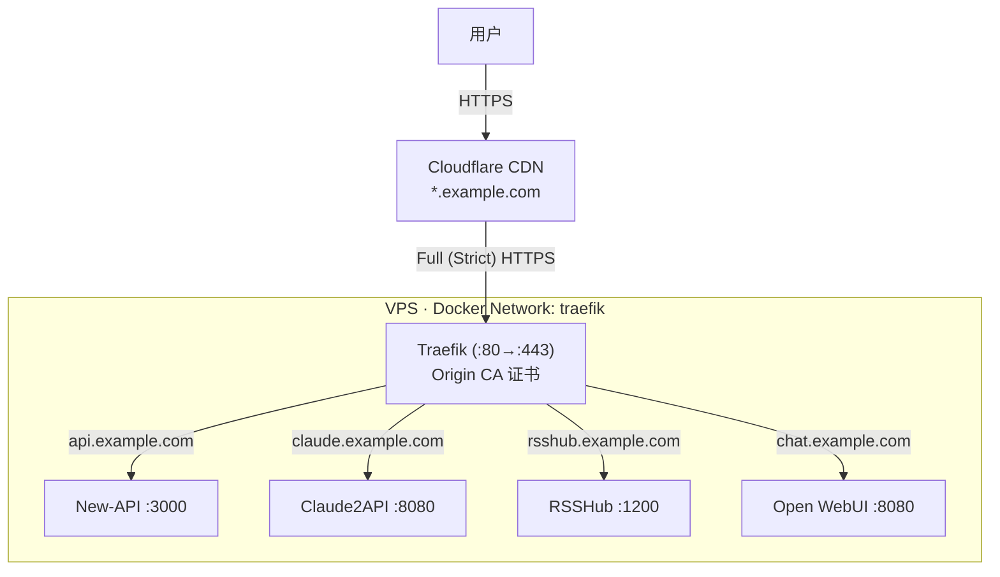

# 用 Traefik 固定对外出口：VPS 迁移只改一条 DNS

[上一篇文章](/posts/ansible-vps)里，我用 Ansible 实现了 VPS 的一键部署，从裸机到所有服务就绪只需要一条命令。目前用着没什么问题，但有两个想法促使我做了这次改造：

一是想接触一下现代的反向代理。之前所有服务都是通过 `IP:端口` 直接暴露的，虽然能用，但总觉得少了点什么。

二是为了应对 VPS 迁移的场景。之前 Cloudcone 的服务器宕机过好几天，如果以后再出现类似的情况需要紧急迁移，所有通过 `IP:端口` 调用的地方——New-API 的调用方、RSSHub 的订阅源、Open WebUI 的书签——都得逐个更新，改漏一个就会断掉。

解决思路很简单：**加一层域名**。所有服务通过子域名访问，VPS 的 IP 只出现在 DNS 记录里。以后不管怎么迁移，只要去 Cloudflare 改一条 A 记录就行了，所有调用方不用动。

## 整体架构



Traefik 作为反向代理，监听 80/443 端口，根据请求的域名把流量转发到对应的容器。各个服务不再直接暴露端口到宿主机，而是通过 Docker 内部网络和 Traefik 通信。

Cloudflare 在前面提供 CDN 和 DDoS 防护，与 Traefik 之间使用 Full (Strict) 模式，保证全链路 HTTPS。

## 为什么选 Traefik

Docker 环境下的反向代理主要有三个选择：Nginx、Caddy、Traefik。

Nginx 最传统，但每加一个服务都要手动写 `server` 块配置然后 reload。Caddy 自动 HTTPS 很方便，但我的场景是 Cloudflare 代理模式，证书由 Cloudflare Origin CA 签发，不需要自动申请 Let's Encrypt。

Traefik 最适合 Docker 环境的一点是：**它能自动发现容器**。只要在 Docker Compose 的 `labels` 里声明路由规则，Traefik 就会自动生效，不需要修改 Traefik 自身的配置，也不需要 reload。加一个新服务就是加几行 label 的事。

## Cloudflare Full (Strict) 模式

Cloudflare 的 SSL/TLS 有四种模式：

- **Off**：全程 HTTP
- **Flexible**：用户到 Cloudflare 是 HTTPS，Cloudflare 到源站是 HTTP
- **Full**：全程 HTTPS，但 Cloudflare 不验证源站证书（自签证书也行）
- **Full (Strict)**：全程 HTTPS，且 Cloudflare 会验证源站证书是否由可信 CA 签发

Flexible 模式虽然最简单，但 Cloudflare 到源站这一段是明文传输。Full (Strict) 是最安全的选择，代价是源站需要安装一个受信任的证书。

好在 Cloudflare 提供了免费的 Origin CA 证书，专门给源站用。在 Cloudflare Dashboard 的 SSL/TLS → Origin Server 里一键生成，有效期最长 15 年，基本可以忘掉续期的事。

生成后会得到两个文件：

```
certs/
├── origin.pem       # 证书
└── origin-key.pem   # 私钥
```

这两个文件需要部署到 VPS 上给 Traefik 使用。

## Traefik 配置

Traefik 的 Docker Compose 文件 `traefik.yml`：

```yaml
services:
    traefik:
        image: traefik:v3
        restart: always
        command:
            - --api.dashboard=true
            - --providers.docker=true
            - --providers.docker.exposedbydefault=false
            - --entrypoints.web.address=:80
            - --entrypoints.websecure.address=:443
            - --entrypoints.web.http.redirections.entrypoint.to=websecure
            - --entrypoints.web.http.redirections.entrypoint.scheme=https
            - --providers.file.filename=/etc/traefik/dynamic.yml
        ports:
            - '80:80'
            - '443:443'
        volumes:
            - /var/run/docker.sock:/var/run/docker.sock:ro
            - /opt/traefik/certs:/etc/traefik/certs:ro
            - /opt/traefik/dynamic.yml:/etc/traefik/dynamic.yml:ro
        labels:
            - traefik.enable=true
            - traefik.http.routers.dashboard.rule=Host(`traefik.example.com`)
            - traefik.http.routers.dashboard.entrypoints=websecure
            - traefik.http.routers.dashboard.tls=true
            - traefik.http.routers.dashboard.service=api@internal
            - traefik.http.routers.dashboard.middlewares=dashboard-auth
            - traefik.http.middlewares.dashboard-auth.basicauth.users=user:$$apr1$$...
        networks:
            - traefik

networks:
    traefik:
        name: traefik
```

几个关键点：

- `--providers.docker=true`：启用 Docker 自动发现，Traefik 会监听 Docker socket，自动感知容器的启停
- `--providers.docker.exposedbydefault=false`：默认不暴露容器，只有显式加了 `traefik.enable=true` label 的容器才会被路由
- `--entrypoints.web.http.redirections`：HTTP 自动跳转 HTTPS
- `--providers.file.filename`：加载文件配置，用于配置 TLS 证书
- Dashboard 通过 `traefik.example.com` 访问，加了 BasicAuth 保护

TLS 证书通过一个动态配置文件 `traefik-dynamic.yml` 加载：

```yaml
tls:
    stores:
        default:
            defaultCertificate:
                certFile: /etc/traefik/certs/origin.pem
                keyFile: /etc/traefik/certs/origin-key.pem
```

这里把 Cloudflare Origin 证书设为默认证书，所有 HTTPS 请求都会使用它。

## 服务改造

改造前，每个服务直接映射端口到宿主机：

```yaml
services:
  rsshub:
    image: diygod/rsshub
    ports:
      - '1200:1200'
```

改造后，去掉 `ports`，换成 Traefik 的 `labels`，并加入 `traefik` 网络：

```yaml
services:
  rsshub:
    image: diygod/rsshub
    labels:
      - traefik.enable=true
      - traefik.http.routers.rsshub.rule=Host(`rsshub.example.com`)
      - traefik.http.routers.rsshub.entrypoints=websecure
      - traefik.http.routers.rsshub.tls=true
      - traefik.http.services.rsshub.loadbalancer.server.port=1200
      - traefik.docker.network=traefik
    networks:
      - default
      - traefik

networks:
  traefik:
    external: true
```

每个 label 的含义：

| Label | 作用 |
|---|---|
| `traefik.enable=true` | 让 Traefik 发现这个容器 |
| `traefik.http.routers.rsshub.rule=Host(...)` | 按域名匹配路由 |
| `traefik.http.routers.rsshub.entrypoints=websecure` | 只监听 HTTPS |
| `traefik.http.routers.rsshub.tls=true` | 启用 TLS |
| `traefik.http.services.rsshub.loadbalancer.server.port=1200` | 容器内部端口 |
| `traefik.docker.network=traefik` | 指定 Traefik 通过哪个网络访问容器 |

网络部分需要注意：每个服务同时加入 `default` 和 `traefik` 两个网络。`default` 是 Compose 项目内部的网络（比如 RSSHub 需要和自己的 Redis 通信），`traefik` 是跨项目的共享网络，让 Traefik 能够访问到各个服务。`traefik` 网络声明为 `external: true`，表示它由 Traefik 的 Compose 文件创建，其他服务只是引用。

所有服务的改造方式完全一致，只需要替换路由名称、域名和端口号。

## Ansible 部署

在 `setup.yml` 里，Traefik 的部署比普通服务多了几步——除了复制 Compose 文件之外，还需要复制证书和动态配置：

```yaml
- name: 创建 Traefik 部署目录
  ansible.builtin.file:
    path: /opt/traefik
    state: directory
    mode: "0755"

- name: 创建 Traefik 证书目录
  ansible.builtin.file:
    path: /opt/traefik/certs
    state: directory
    mode: "0700"

- name: 复制 Cloudflare Origin 证书
  ansible.builtin.copy:
    src: certs/origin.pem
    dest: /opt/traefik/certs/origin.pem
    mode: "0600"

- name: 复制 Cloudflare Origin 私钥
  ansible.builtin.copy:
    src: certs/origin-key.pem
    dest: /opt/traefik/certs/origin-key.pem
    mode: "0600"

- name: 复制 Traefik 动态配置文件到远程
  ansible.builtin.copy:
    src: traefik-dynamic.yml
    dest: /opt/traefik/dynamic.yml
    mode: "0644"

- name: 复制 Traefik Docker Compose 文件到远程
  ansible.builtin.copy:
    src: traefik.yml
    dest: /opt/traefik/docker-compose.yml
    mode: "0644"

- name: 启动 Traefik 服务
  community.docker.docker_compose_v2:
    project_src: /opt/traefik
    state: present
    pull: always
```

证书文件的权限设为 `0600`，目录设为 `0700`，确保只有 root 可以读取。

Traefik 必须在其他服务之前部署，因为它会创建 `traefik` 这个 Docker 网络，后续的服务都依赖这个网络。

## 迁移前后对比

| | 迁移前 | 迁移后 |
|---|---|---|
| 访问方式 | `72.18.xx.xx:3000` | `api.example.com` |
| 换 IP 影响 | 所有调用方都要改 | 只改 Cloudflare DNS 记录 |
| HTTPS | 无（或需要各服务自己配证书） | Traefik 统一处理 |
| 端口管理 | 每个服务占一个端口，需要记住端口号 | 统一走 443，按域名路由 |
| 新增服务 | 选一个不冲突的端口 | 加几行 label |

## 总结

这次改造的核心目标就一个：**让 VPS 的 IP 地址不再出现在任何调用方的配置中**。

通过 Traefik + Cloudflare 的组合，所有服务都收敛到子域名访问。以后不管是 VPS 到期换机器、IP 被墙、还是迁移到其他服务商，流程都是：

1. 新机器跑一遍 `uv run ansible-playbook setup.yml`
2. 去 Cloudflare 改一下 A 记录指向新 IP

两步搞定，所有服务恢复访问，调用方零感知。
